# Báo cáo nghiên cứu nhu cầu tuyển dụng và khoảng cách kỹ năng IT tại Việt Nam

## 1. Mục tiêu nghiên cứu

Báo cáo này tổng hợp ba nhóm dữ liệu:

1. Dữ liệu JD đã cào và xử lý từ các nền tảng tuyển dụng IT.
2. Thống kê định lượng từ file `all_jobs_final_analysis_filtered.csv`.
3. Nhận định từ các báo cáo thị trường IT/tuyển dụng công khai như TopDev, ITviec, VietnamWorks/Navigos Group.

Mục tiêu chính là trả lời câu hỏi:

> Sinh viên IT cần học gì và học như thế nào để phù hợp với nhu cầu thực tế của doanh nghiệp?

Báo cáo ưu tiên tính thực tế, dùng số liệu từ JD để xác định kỹ năng doanh nghiệp đang yêu cầu, sau đó đối chiếu với báo cáo thị trường để rút ra gap và đề xuất cách học.

---

## 2. Phạm vi và dữ liệu nghiên cứu

### 2.1. Đối tượng nghiên cứu

- Doanh nghiệp IT và doanh nghiệp có tuyển dụng vị trí công nghệ tại Việt Nam.
- Các nhóm vị trí chính:
  - Software Engineer / Software Developer
  - Data Engineer
  - Data Scientist
  - AI/ML Engineer
  - Cybersecurity
  - Business Analyst
  - Data Analyst
  - QA/QC/Tester
  - DevOps/SRE
  - Embedded/IoT

### 2.2. Bộ dữ liệu JD đã phân tích

| Chỉ số                                | Giá trị |
| --------------------------------------- | --------: |
| Tổng số JD sau lọc                   |       837 |
| Số cột dữ liệu                      |        18 |
| Số JD có thông tin năm kinh nghiệm |       691 |
| Năm kinh nghiệm trung bình           | 4.23 năm |
| Trung vị năm kinh nghiệm             |  4.0 năm |

### 2.3. Phân bố nguồn dữ liệu

| Nguồn                                 | Số JD | Tỷ lệ trên tổng JD |
| -------------------------------------- | -----: | ---------------------: |
| VietnamWorks_sync + VietnamWorks_async |    373 |                 44.56% |
| ITviec                                 |    299 |                 35.72% |
| VietnamWorks_async                     |     81 |                  9.68% |
| VietnamWorks_sync                      |     56 |                  6.69% |
| TopDev                                 |     28 |                  3.35% |

### 2.4. Độ phủ các nhóm thông tin sau xử lý

| Nhóm dữ liệu                                      | JD có dữ liệu | Tỷ lệ trên tổng JD | Số giá trị khác nhau |
| ---------------------------------------------------- | ---------------: | ---------------------: | -----------------------: |
| Nhóm vị trí công việc (`role_category`)       |              813 |                 97.13% |                       12 |
| Kỹ năng mềm (`soft_skills`)                     |              773 |                 92.35% |                       15 |
| Ngôn ngữ lập trình / Nền tảng (`languages`)  |              735 |                 87.81% |                       19 |
| Cấp độ kinh nghiệm (`experience_level`)        |              680 |                 81.24% |                        8 |
| Yêu cầu học vấn / Bằng cấp (`education`)     |              600 |                 71.68% |                        4 |
| Quy trình / Phong cách làm việc (`work_style`) |              500 |                 59.74% |                       14 |
| Yêu cầu ngoại ngữ (`language_requirement`)     |              495 |                 59.14% |                        5 |
| Công cụ DevOps & Hạ tầng (`devops_tools`)      |              339 |                 40.50% |                       10 |
| Kỹ năng & Công cụ Data/AI (`data_ai`)          |              327 |                 39.07% |                       23 |
| Cơ sở dữ liệu (`databases`)                    |              238 |                 28.43% |                       13 |
| Framework & Thư viện (`frameworks`)              |              237 |                 28.32% |                       18 |
| Phương pháp phát triển (`methodology`)        |              236 |                 28.20% |                        9 |
| Nền tảng đám mây (`cloud`)                    |              205 |                 24.49% |                        3 |

Lưu ý: một JD có thể thuộc nhiều nhóm kỹ năng hoặc nhiều nhóm vị trí, vì vậy tổng tỷ lệ của các bảng kỹ năng có thể vượt 100%.

---

## 3. Tổng quan thị trường từ dữ liệu JD

### 3.1. Nhóm vị trí được tuyển nhiều nhất

| Nhóm vị trí       | Số JD | Tỷ lệ trên tổng JD |
| -------------------- | -----: | ---------------------: |
| Software Engineering |    396 |                 47.31% |
| AI/ML Engineering    |    233 |                 27.84% |
| Quality Assurance    |    220 |                 26.28% |
| Data Engineering     |    189 |                 22.58% |
| Business Analysis    |    159 |                 19.00% |
| Data Science         |    133 |                 15.89% |
| Data Analysis        |     96 |                 11.47% |
| Cybersecurity        |     91 |                 10.87% |
| Embedded System      |     62 |                  7.41% |
| DevOps/SRE           |     60 |                  7.17% |

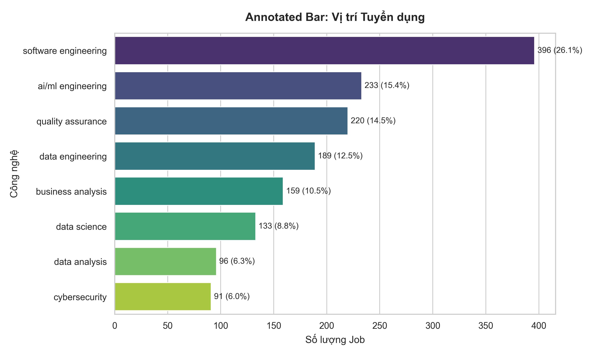

**Nhận xét:** Software Engineering vẫn là nhóm nhu cầu lớn nhất, chiếm gần một nửa tổng số JD. Tuy nhiên, các nhóm AI/ML, Data Engineering, Data Science và Data Analysis cũng xuất hiện với tỷ lệ đáng kể, cho thấy thị trường đang dịch chuyển mạnh sang dữ liệu và trí tuệ nhân tạo.

### 3.2. Nhu cầu theo cấp độ kinh nghiệm

| Cấp độ      | Số JD | Tỷ lệ trên tổng JD |
| -------------- | -----: | ---------------------: |
| Senior         |    377 |                 45.04% |
| Manager        |    323 |                 38.59% |
| Middle         |    229 |                 27.36% |
| Lead/Principal |    182 |                 21.74% |
| Junior         |     69 |                  8.24% |
| Fresher        |     55 |                  6.57% |
| Director       |     32 |                  3.82% |
| Intern         |     19 |                  2.27% |

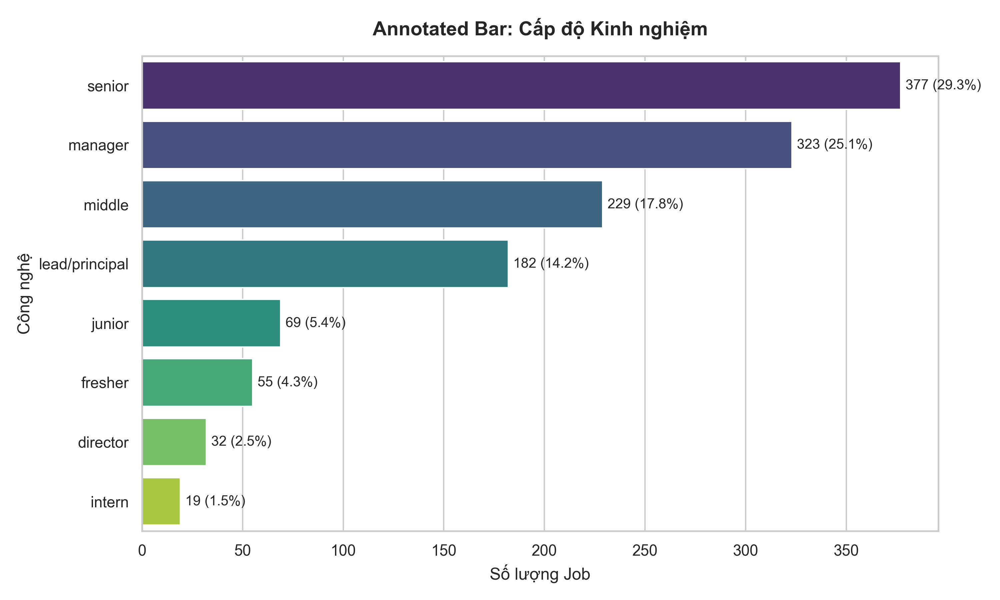

**Nhận xét:** Thị trường ưu tiên ứng viên có kinh nghiệm, đặc biệt là senior, middle, lead và các vai trò quản lý. Điều này cho thấy doanh nghiệp cần người có thể tham gia dự án nhanh, ít cần đào tạo lại từ đầu. Đây là một thách thức lớn cho sinh viên mới ra trường nếu chỉ có kiến thức lý thuyết.

### 3.3. Số năm kinh nghiệm trung bình theo nhóm vị trí

| Nhóm vị trí       | Số JD có năm KN | Năm KN trung bình | Trung vị |
| -------------------- | -----------------: | ------------------: | --------: |
| Data Science         |                113 |                5.08 |       4.0 |
| AI/ML Engineering    |                201 |                4.65 |       4.0 |
| Product Management   |                 20 |                4.55 |       5.0 |
| Embedded System      |                 51 |                4.47 |       3.0 |
| Data Engineering     |                156 |                4.35 |       4.0 |
| Cybersecurity        |                 68 |                4.35 |       5.0 |
| Business Analysis    |                143 |                4.31 |       4.0 |
| Software Engineering |                308 |                4.17 |       3.0 |
| DevOps/SRE           |                 56 |                4.12 |       4.0 |
| Project Management   |                 35 |                4.00 |       5.0 |

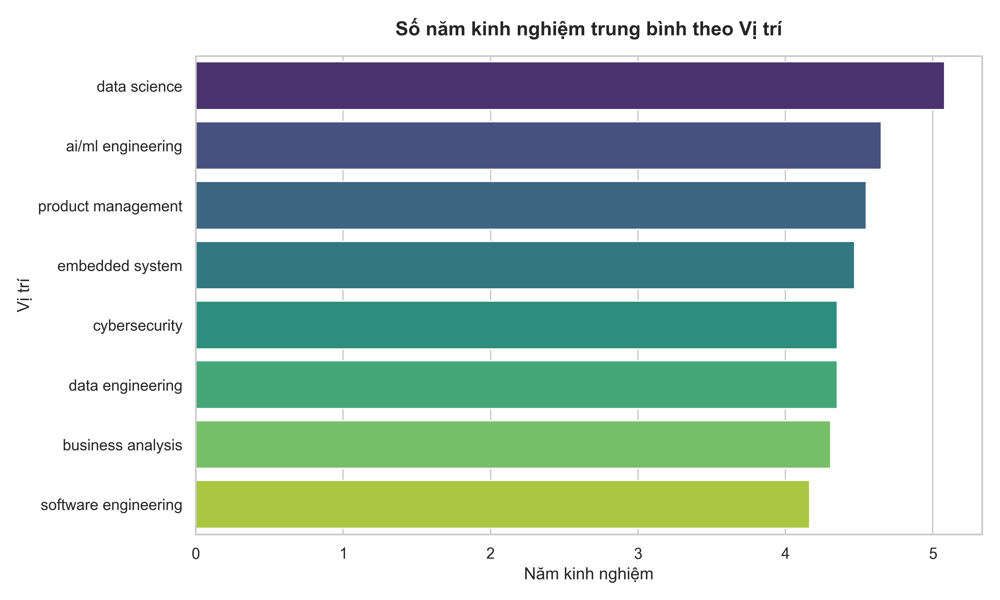

**Nhận xét:** Data Science là nhóm có yêu cầu kinh nghiệm trung bình cao nhất trong dữ liệu, khoảng 5.08 năm. AI/ML, Data Engineering, Cybersecurity và BA cũng yêu cầu kinh nghiệm tương đối cao. Điều này cho thấy các lĩnh vực mới không chỉ cần biết công cụ, mà cần nền tảng, khả năng phân tích và kinh nghiệm xử lý bài toán thực tế.

### 3.4. Yêu cầu học vấn

*Tổng số tin tuyển dụng (JD) có nêu yêu cầu cụ thể về cấp học là 625/837 JD (chiếm 74.68%). Phần còn lại không bắt buộc hoặc không ghi rõ trình độ.*

| Trình độ học vấn                | Số JD | Tỷ lệ trên tổng JD (837) |
| ------------------------------------ | -----: | ---------------------------: |
| Đại học (Bachelor's)              |    522 |                       62.37% |
| Thạc sĩ / Tiến sĩ (Master's/PhD) |     77 |                        9.20% |
| Cao đẳng / Trung cấp (College)    |     26 |                        3.11% |
| Không ghi rõ                       |    212 |                       25.32% |

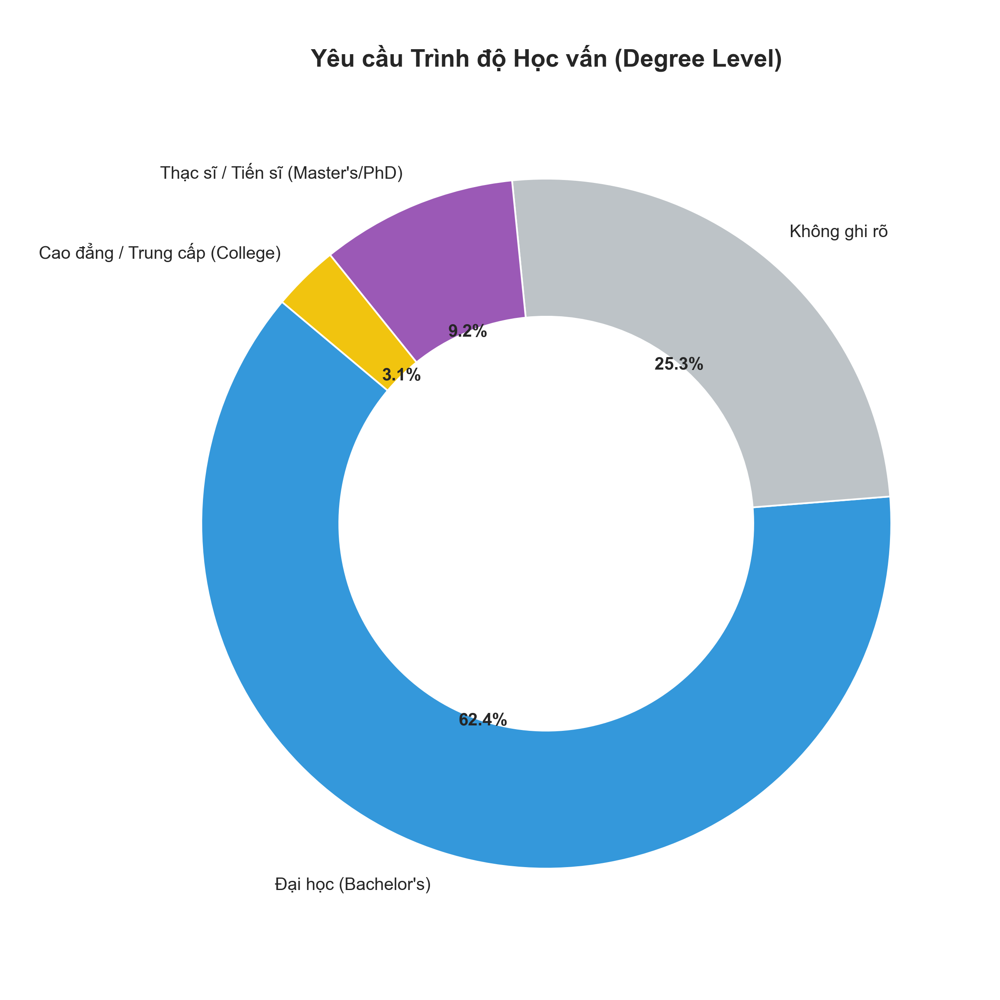

**Nhận xét:** Dù IT là ngành coi trọng năng lực thực tế, bằng Cử nhân (62.37%) vẫn là tiêu chí tuyển dụng phổ biến nhất, đóng vai trò là bộ lọc quan trọng ở các doanh nghiệp lớn. Nhóm Cao đẳng (3.11%) hay Thạc sĩ/Tiến sĩ (9.20%) chỉ chiếm tỷ lệ nhỏ. Khoảng 25.32% các tin tuyển dụng không yêu cầu hoặc không ghi rõ trình độ bằng cấp cụ thể.

---

## 4. Nhu cầu kỹ năng kỹ thuật

### 4.1. Ngôn ngữ lập trình và nền tảng

| Ngôn ngữ/nền tảng | Số JD | Tỷ lệ trên tổng JD |
| --------------------- | -----: | ---------------------: |
| Python                |    365 |                 43.61% |
| SQL                   |    307 |                 36.68% |
| Java                  |    146 |                 17.44% |
| C++                   |    104 |                 12.43% |
| Golang                |     99 |                 11.83% |
| JavaScript            |     78 |                  9.32% |
| C#                    |     76 |                  9.08% |
| HTML/CSS              |     63 |                  7.53% |
| TypeScript            |     53 |                  6.33% |
| R                     |     42 |                  5.02% |

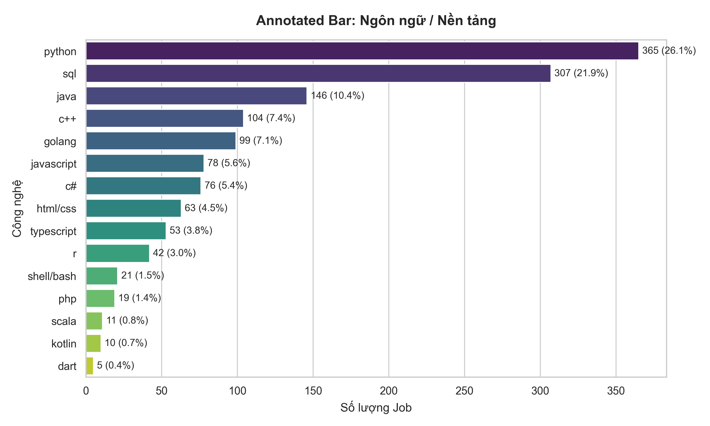

**Nhận xét:** Python và SQL dẫn đầu, phản ánh nhu cầu mạnh ở cả backend, data, AI và phân tích dữ liệu. Java, C++, Golang, JavaScript/C# vẫn quan trọng trong phát triển phần mềm doanh nghiệp. Sinh viên không nên chỉ học một ngôn ngữ ở mức cú pháp, mà cần biết dùng ngôn ngữ đó để xây dựng sản phẩm hoàn chỉnh.

### 4.2. Framework và công nghệ phát triển phần mềm

| Framework/công nghệ | Số JD | Tỷ lệ trên tổng JD |
| --------------------- | -----: | ---------------------: |
| React                 |     76 |                  9.08% |
| .NET                  |     72 |                  8.60% |
| Node.js               |     45 |                  5.38% |
| LangChain             |     42 |                  5.02% |
| Spring Boot           |     39 |                  4.66% |
| Angular               |     29 |                  3.46% |
| Spring                |     26 |                  3.11% |
| LangGraph             |     25 |                  2.99% |
| FastAPI               |     23 |                  2.75% |
| Vue.js                |     23 |                  2.75% |

**Nhận xét:** React, .NET, Node.js và Spring Boot là các công nghệ phổ biến trong phát triển sản phẩm. LangChain và LangGraph xuất hiện trong nhóm đầu cho thấy nhu cầu liên quan LLM/RAG đang tăng. Với sinh viên, cách học phù hợp là chọn một stack chính và làm sâu thay vì học quá nhiều framework rời rạc.

### 4.3. Database

| Database      | Số JD | Tỷ lệ trên tổng JD |
| ------------- | -----: | ---------------------: |
| Oracle        |     95 |                 11.35% |
| PostgreSQL    |     90 |                 10.75% |
| MySQL         |     67 |                  8.00% |
| SQL Server    |     59 |                  7.05% |
| MongoDB       |     55 |                  6.57% |
| Redis         |     42 |                  5.02% |
| Elasticsearch |     22 |                  2.63% |
| Firebase      |     12 |                  1.43% |
| Milvus        |      9 |                  1.08% |
| Pinecone      |      7 |                  0.84% |

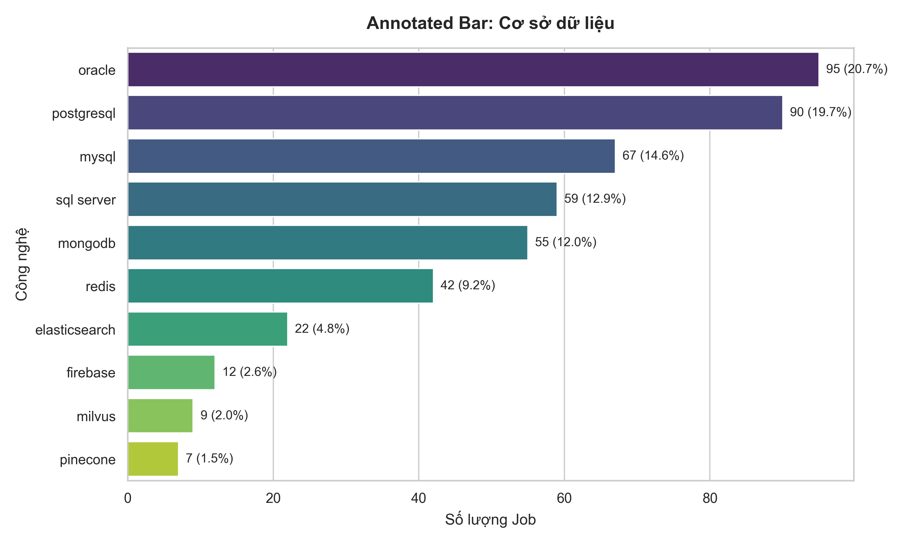

**Nhận xét:** SQL vẫn là năng lực nền tảng quan trọng. Oracle, PostgreSQL, MySQL và SQL Server xuất hiện nhiều, cho thấy doanh nghiệp vẫn dựa nhiều vào hệ quản trị cơ sở dữ liệu quan hệ. MongoDB, Redis, Elasticsearch và vector database như Milvus/Pinecone xuất hiện trong các bài toán hiện đại hơn.

### 4.4. Cloud

| Cloud | Số JD | Tỷ lệ trên tổng JD |
| ----- | -----: | ---------------------: |
| AWS   |    163 |                 19.47% |
| Azure |    113 |                 13.50% |
| GCP   |     81 |                  9.68% |

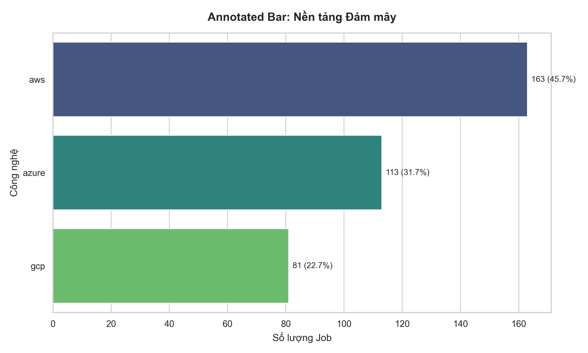

**Nhận xét:** AWS dẫn đầu trong dữ liệu, tiếp theo là Azure và GCP. Sinh viên không nhất thiết phải học sâu cả ba nền tảng, nhưng cần hiểu khái niệm cơ bản về deploy, storage, compute, database managed service, networking và bảo mật trên cloud.

### 4.5. DevOps và hạ tầng

| Công cụ/kỹ năng | Số JD | Tỷ lệ trên tổng JD |
| ------------------- | -----: | ---------------------: |
| CI/CD               |    188 |                 22.46% |
| Docker              |    133 |                 15.89% |
| Microservices       |     93 |                 11.11% |
| Kubernetes          |     91 |                 10.87% |
| Linux               |     82 |                  9.80% |
| Kafka               |     64 |                  7.65% |
| Jenkins             |     28 |                  3.35% |
| Terraform           |     19 |                  2.27% |
| RabbitMQ            |     17 |                  2.03% |
| Nginx               |      5 |                  0.60% |

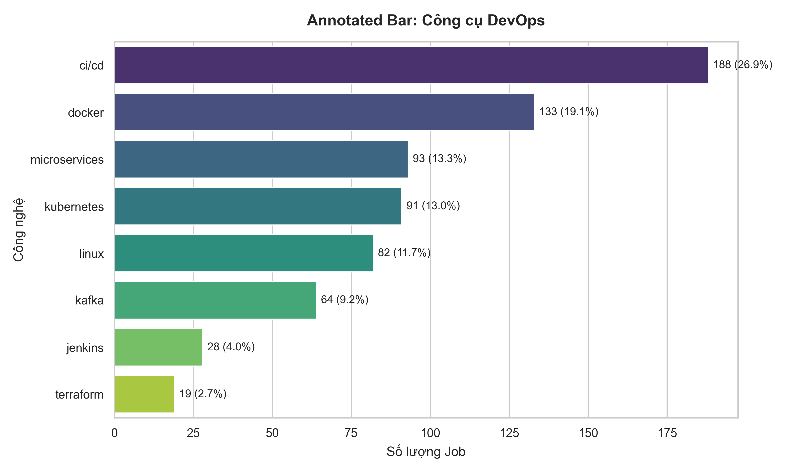

**Nhận xét:** CI/CD, Docker, Microservices, Kubernetes và Linux cho thấy doanh nghiệp không chỉ cần người biết code, mà cần người hiểu cách đưa phần mềm vào môi trường vận hành. Với sinh viên, tối thiểu nên biết Git, Docker, cách deploy một ứng dụng và đọc log khi có lỗi.

### 4.6. Data/AI

| Kỹ năng Data/AI | Số JD | Tỷ lệ trên tổng JD |
| ----------------- | -----: | ---------------------: |
| Machine Learning  |    140 |                 16.73% |
| LLM               |    103 |                 12.31% |
| Power BI          |     90 |                 10.75% |
| RAG               |     65 |                  7.77% |
| TensorFlow        |     60 |                  7.17% |
| PyTorch           |     56 |                  6.69% |
| NLP               |     52 |                  6.21% |
| Tableau           |     51 |                  6.09% |
| ETL               |     48 |                  5.73% |
| Deep Learning     |     47 |                  5.62% |

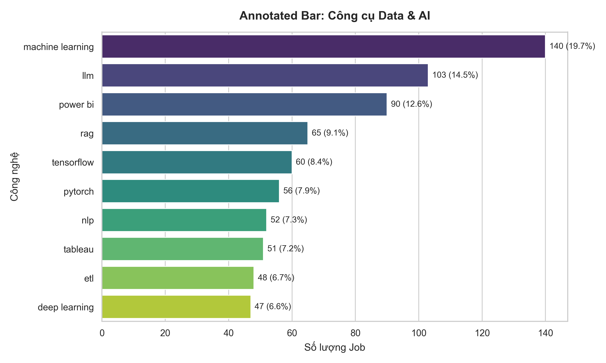

**Nhận xét:** Machine Learning, LLM, RAG và các công cụ BI xuất hiện rõ trong JD. Điều này phù hợp với xu hướng thị trường từ các báo cáo TopDev và ITviec. Tuy nhiên, AI/Data không chỉ là dùng model có sẵn; sinh viên cần nền tảng Python, SQL, xác suất thống kê, đánh giá mô hình, xử lý dữ liệu và tư duy sản phẩm.

---

## 5. Kỹ năng mềm, ngoại ngữ và phong cách làm việc

### 5.1. Kỹ năng mềm

| Kỹ năng mềm     | Số JD | Tỷ lệ trên tổng JD |
| ------------------ | -----: | ---------------------: |
| Communication      |    459 |                 54.84% |
| Analytical         |    398 |                 47.55% |
| Teamwork           |    369 |                 44.09% |
| Mentoring          |    334 |                 39.90% |
| Work Independently |    278 |                 33.21% |
| Responsibility     |    259 |                 30.94% |
| Problem Solving    |    240 |                 28.67% |
| Leadership         |    193 |                 23.06% |
| Adaptability       |    157 |                 18.76% |
| Creativity         |    131 |                 15.65% |

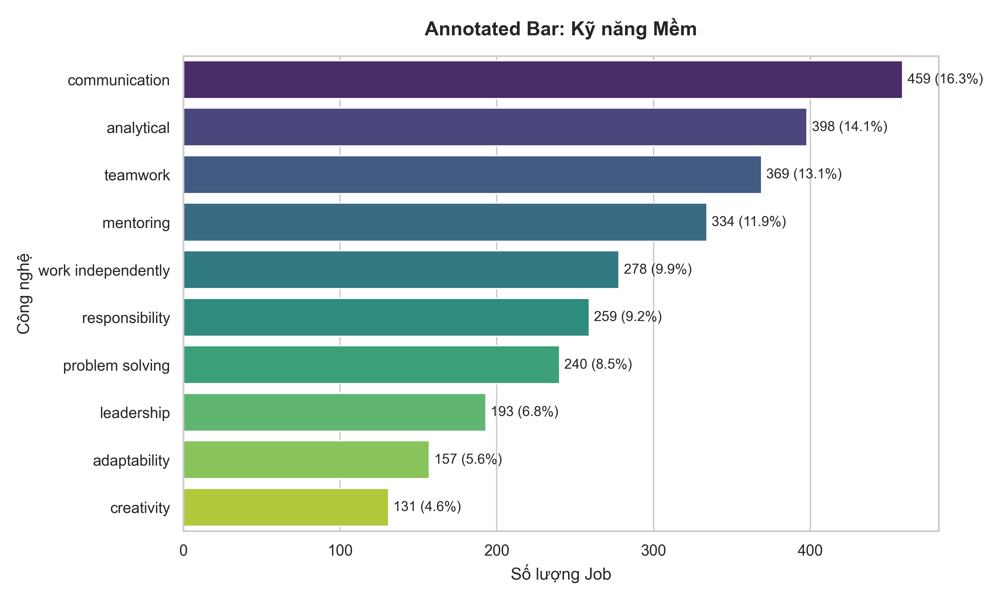

**Nhận xét:** Communication, Analytical, Teamwork và Problem Solving là các kỹ năng nổi bật. Điều này cho thấy doanh nghiệp đánh giá cao khả năng trao đổi, phân tích yêu cầu, phối hợp với nhóm và tự giải quyết vấn đề, không chỉ khả năng viết code.

### 5.2. Ngoại ngữ

| Ngoại ngữ | Số JD | Tỷ lệ trên tổng JD |
| ----------- | -----: | ---------------------: |
| English     |    472 |                 56.39% |
| Japanese    |     40 |                  4.78% |
| Chinese     |     27 |                  3.23% |
| Korean      |     13 |                  1.55% |
| French      |      2 |                  0.24% |

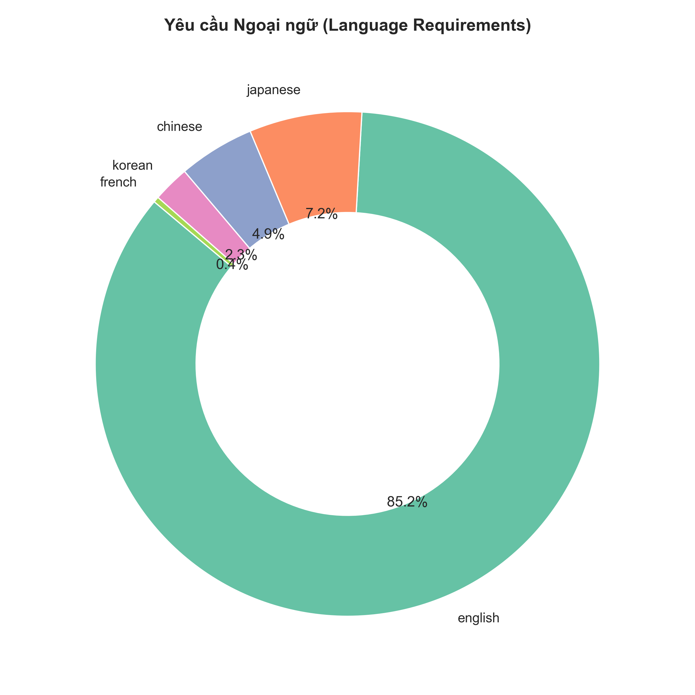

**Nhận xét:** English là ngoại ngữ quan trọng nhất. Trong ngành IT, tiếng Anh không chỉ dùng để giao tiếp mà còn để đọc tài liệu, viết issue, hiểu log, đọc API docs, viết báo cáo kỹ thuật và làm việc với khách hàng/quản lý nước ngoài.

### 5.3. Phương pháp và phong cách làm việc

| Phương pháp | Số JD | Tỷ lệ trên tổng JD |
| -------------- | -----: | ---------------------: |
| DevOps         |    115 |                 13.74% |
| Agile          |    101 |                 12.07% |
| SDLC           |     44 |                  5.26% |
| Scrum          |     36 |                  4.30% |
| SAFe           |     16 |                  1.91% |
| DDD            |      9 |                  1.08% |
| Waterfall      |      9 |                  1.08% |
| Kanban         |      3 |                  0.36% |
| Lean           |      1 |                  0.12% |

| Phong cách/quy trình | Số JD | Tỷ lệ trên tổng JD |
| ---------------------- | -----: | ---------------------: |
| Documentation          |    294 |                 35.13% |
| SOLID                  |    129 |                 15.41% |
| REST API               |     86 |                 10.27% |
| System Design          |     64 |                  7.65% |
| Remote/Hybrid          |     57 |                  6.81% |
| OOP                    |     47 |                  5.62% |
| Unit Test              |     36 |                  4.30% |
| Code Review            |     27 |                  3.23% |
| GraphQL                |     23 |                  2.75% |
| Clean Code             |     17 |                  2.03% |

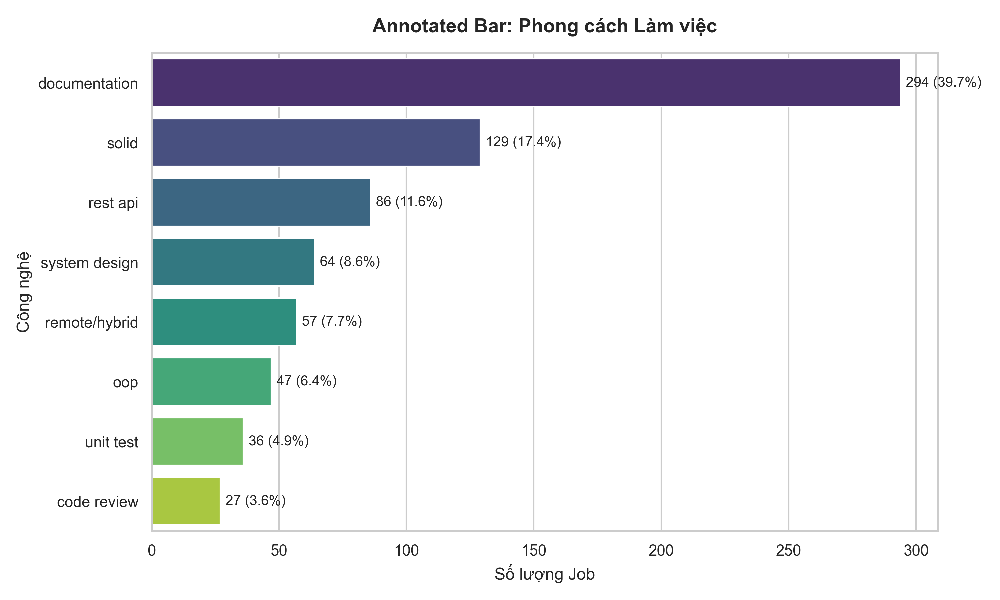

**Nhận xét:** Documentation, SOLID, REST API, System Design, Unit Test và Code Review là các tín hiệu rõ ràng cho thấy doanh nghiệp cần ứng viên hiểu quy trình phát triển phần mềm chuyên nghiệp. Sinh viên nên tập thói quen viết tài liệu, tạo pull request, review code và test ngay từ project cá nhân/đồ án nhóm.

---

## 6. Nhận định từ các báo cáo thị trường tuyển dụng IT

### 6.1. Thị trường IT Việt Nam vẫn tăng trưởng nhưng tiêu chuẩn cao hơn

Theo TopDev, thị trường công nghệ Việt Nam tiếp tục được thúc đẩy bởi chuyển đổi số, đầu tư nước ngoài và sự mở rộng của các trung tâm R&D. Các lĩnh vực nổi bật gồm AI, Big Data, Cloud Computing, Cybersecurity và phát triển phần mềm doanh nghiệp.

TopDev cũng nhấn mạnh tình trạng thiếu hụt nhân lực công nghệ có kỹ năng chuyên sâu. Một con số đáng chú ý là Việt Nam cần bổ sung khoảng 500.000 lao động công nghệ đến năm 2025 để đáp ứng nhu cầu thị trường.

**Ý nghĩa:** cơ hội việc làm vẫn lớn, nhưng thị trường cần người làm được việc thật, không chỉ biết kiến thức cơ bản.

### 6.2. Doanh nghiệp ưu tiên ứng viên có kinh nghiệm thực chiến

Báo cáo ITviec và dữ liệu JD đều cho thấy nhu cầu tập trung vào backend/full-stack, frontend, testing, cloud/devops, data/AI và security. Các vị trí này yêu cầu ứng viên có khả năng tham gia dự án thực tế, hiểu công cụ và quy trình phát triển sản phẩm.

**Ý nghĩa:** portfolio, project end-to-end, kinh nghiệm thực tập và khả năng trình bày sản phẩm trở thành lợi thế quan trọng với sinh viên.

### 6.3. AI là kỹ năng hỗ trợ công việc, không chỉ là chuyên ngành riêng

Theo bài tổng hợp từ ITviec, khoảng 68.5% lập trình viên sử dụng AI để hỗ trợ hoàn thành code. TopDev cũng xem AI, Big Data và Cloud là các nhóm công nghệ có nhu cầu tăng mạnh.

Tuy nhiên, doanh nghiệp không chỉ cần người biết dùng chatbot để sinh code. Họ cần người biết kiểm tra, debug, đánh giá rủi ro, bảo vệ dữ liệu và tích hợp AI vào bài toán thật.

### 6.4. Cloud, DevOps và Security trở thành năng lực nền

TopDev nhấn mạnh nhu cầu Cloud Computing và Cybersecurity. Các bài tổng hợp từ ITviec cũng ghi nhận các vị trí Cloud Engineer, AI/Blockchain Engineer và Security Engineer có mức lương cạnh tranh.

Ví dụ, bản tổng hợp ITviec ghi nhận Security Engineer có mức lương trung bình khoảng 60.6 triệu VND/tháng với khoảng 8 năm kinh nghiệm; Cloud Engineer khoảng 29.2 triệu VND/tháng với khoảng 3 năm kinh nghiệm.

**Ý nghĩa:** ngay cả sinh viên theo hướng Software Engineer cũng nên có kiến thức nền về cloud, Docker, CI/CD, bảo mật API và vận hành hệ thống.

### 6.5. Tiếng Anh và kỹ năng mềm là yêu cầu quan trọng

Theo Talent Guide 2024 của Navigos Group/VietnamWorks, các kỹ năng cần phát triển nổi bật gồm:

- Ngoại ngữ: khoảng 55.1%.
- Tư duy phân tích/tư duy phản biện: khoảng 55.1%.
- Tư duy sáng tạo: khoảng 48.2%.
- Giải quyết vấn đề: khoảng 42.2%.

Theo bài tổng hợp từ ITviec, tiếng Anh cũng là kỹ năng mềm được nhiều công ty ưu tiên, với tỷ lệ khoảng 40.3% công ty.

**Ý nghĩa:** kỹ năng mềm nên được rèn qua project nhóm, thuyết trình, viết tài liệu, review code và làm việc với yêu cầu chưa rõ ràng.

### 6.6. Thị trường tuyển dụng thận trọng hơn

Talent Guide 2024 cho thấy năm 2023 nhiều doanh nghiệp chịu ảnh hưởng bởi biến động kinh tế:

- Khoảng 82% doanh nghiệp bị ảnh hưởng bởi biến động thị trường.
- Khoảng 68.7% doanh nghiệp chọn cắt giảm nhân sự.
- Khoảng 52.6% doanh nghiệp dừng tuyển dụng mới.

Tuy vậy, thị trường vẫn có nhu cầu tuyển dụng, nhưng chọn lọc hơn. Ứng viên cần chứng minh năng lực bằng sản phẩm, kinh nghiệm thực hành và khả năng thích nghi.

---

## 7. Đối chiếu dữ liệu JD với báo cáo thị trường

| Nhóm nhu cầu       | Kết quả từ JD đã cào                                                 | Kết quả từ báo cáo thị trường                                                                    | Kết luận                                                                        |
| -------------------- | -------------------------------------------------------------------------- | -------------------------------------------------------------------------------------------------------- | --------------------------------------------------------------------------------- |
| Software Engineering | 396 JD, chiếm 47.31%, là nhóm lớn nhất                                | ITviec ghi nhận backend/full-stack, frontend, testing là các nhóm kỹ năng tuyển dụng quan trọng | Sinh viên nên ưu tiên một stack phát triển phần mềm hoàn chỉnh         |
| Data/AI              | Machine Learning, LLM, Power BI, RAG, TensorFlow xuất hiện rõ           | TopDev và Navigos nhấn mạnh AI, phân tích dữ liệu là vị trí mới nổi                          | Nên học Data/AI trên nền tảng Python, SQL, thống kê và project thực tế  |
| Cloud/DevOps         | CI/CD, Docker, Microservices, Kubernetes, AWS/Azure/GCP xuất hiện nhiều | TopDev nhấn mạnh Cloud Computing; ITviec ghi nhận Cloud Engineer là vị trí mới nổi               | Dev hiện đại cần biết triển khai và vận hành cơ bản                    |
| Security             | Cybersecurity có 91 JD, chiếm 10.87%                                     | TopDev nhấn mạnh Cybersecurity; ITviec ghi nhận Security Engineer có lương cao                     | Sinh viên cần học bảo mật nền tảng dù không theo chuyên ngành Security |
| Kỹ năng mềm       | Communication 54.84%, Analytical 47.55%, Teamwork 44.09%                   | Navigos/VietnamWorks nhấn mạnh ngoại ngữ, tư duy phản biện, giải quyết vấn đề                | Kỹ năng mềm phải được rèn trong project và môi trường nhóm           |
| Tiếng Anh           | English xuất hiện trong 472 JD, chiếm 56.39%                            | ITviec và Navigos đều xem tiếng Anh/ngoại ngữ là kỹ năng quan trọng                            | Tiếng Anh là năng lực làm việc, không chỉ là môn học                   |

---

## 8. Gap chính của sinh viên so với nhu cầu doanh nghiệp

### 8.1. Biết kiến thức rời rạc nhưng thiếu năng lực tạo sản phẩm

Sinh viên thường học nhiều môn riêng lẻ như lập trình, cơ sở dữ liệu, cấu trúc dữ liệu, mạng máy tính. Tuy nhiên, doanh nghiệp cần người biết kết nối các phần này thành sản phẩm hoàn chỉnh.

**Gap:** thiếu tư duy end-to-end.

**Ví dụ:** biết SQL nhưng chưa từng thiết kế schema cho một web app thật; biết Python nhưng chưa từng viết API, xử lý lỗi, logging, deploy.

### 8.2. Thiếu kinh nghiệm với quy trình làm việc thật

Doanh nghiệp yêu cầu Git, code review, Agile/Scrum, CI/CD, task management và teamwork. Trong khi đó, nhiều sinh viên vẫn làm bài theo kiểu cá nhân, nộp file zip hoặc chỉ chạy được trên máy mình.

**Gap:** thiếu môi trường mô phỏng doanh nghiệp.

**Ví dụ:** chưa biết tạo pull request, chưa biết review code, chưa biết chia task theo sprint, chưa biết viết README để người khác chạy được project.

### 8.3. Học công nghệ theo trend nhưng thiếu nền tảng

AI, LLM, Cloud, Blockchain là xu hướng hấp dẫn. Tuy nhiên, nếu học theo trend mà thiếu nền tảng lập trình, database, hệ điều hành, mạng, xác suất thống kê và tư duy hệ thống thì khó đi xa.

**Gap:** biết dùng công cụ nhưng chưa hiểu bản chất.

**Ví dụ:** dùng AI để sinh code nhưng không debug được; dùng model AI có sẵn nhưng không biết đánh giá dữ liệu đầu vào và đầu ra.

### 8.4. Tiếng Anh và giao tiếp kỹ thuật chưa đủ

Các báo cáo đều nhấn mạnh ngoại ngữ, giao tiếp và tư duy phân tích. Sinh viên có thể viết code tốt nhưng gặp khó khi đọc tài liệu, viết issue, trình bày giải pháp hoặc trao đổi với BA/QA/PM.

**Gap:** thiếu năng lực giao tiếp kỹ thuật.

**Ví dụ:** không giải thích được vì sao chọn một giải pháp, không viết được tài liệu API, không phản biện được yêu cầu chưa rõ.

---

## 9. Sinh viên nên học gì?

### 9.1. Nhóm nền tảng bắt buộc

- Một ngôn ngữ lập trình chính: Java, Python, JavaScript/TypeScript, C# hoặc Go.
- Cấu trúc dữ liệu và giải thuật ở mức đủ để giải quyết vấn đề.
- SQL và thiết kế cơ sở dữ liệu.
- Git và GitHub/GitLab.
- HTTP, REST API, authentication cơ bản.
- OOP, clean code, testing cơ bản.
- Linux command line cơ bản.
- Kiến thức bảo mật nền tảng: OWASP Top 10, bảo mật API, quản lý secret.

### 9.2. Nhóm kỹ năng theo hướng nghề nghiệp

| Hướng nghề nghiệp    | Nên học trọng tâm                                                                              |
| ------------------------ | -------------------------------------------------------------------------------------------------- |
| Backend Engineer         | Java/Spring Boot hoặc Node.js/NestJS, REST API, SQL, caching, message queue, Docker               |
| Frontend Engineer        | HTML/CSS/JavaScript, TypeScript, React/Vue, state management, UI testing, API integration          |
| Full-stack Engineer      | Một frontend framework + một backend framework + database + deploy                               |
| Data Engineer            | Python, SQL nâng cao, ETL, data warehouse, Spark cơ bản, Airflow, cloud storage                 |
| Data Analyst/BI          | SQL, Excel, Power BI/Tableau, thống kê mô tả, storytelling bằng dữ liệu                     |
| Data Science/AI/ML       | Python, statistics, machine learning, model evaluation, TensorFlow/PyTorch, MLOps cơ bản         |
| AI Engineer/LLM Engineer | Python, API integration, embeddings, vector database, RAG, prompt evaluation, bảo mật dữ liệu  |
| QA/Tester                | Test case design, manual testing, automation testing, API testing, Selenium/Playwright, CI         |
| Security                 | Network, Linux, web security, OWASP Top 10, secure coding, log analysis, incident basics           |
| BA                       | Requirement gathering, user story, BPMN/UML cơ bản, SQL cơ bản, giao tiếp và tài liệu hóa |

### 9.3. Nhóm kỹ năng làm việc

- Tiếng Anh đọc hiểu tài liệu kỹ thuật.
- Viết README, API docs, issue, pull request description.
- Giao tiếp trong nhóm.
- Phân tích yêu cầu.
- Tư duy phản biện.
- Tự học và cập nhật công nghệ.
- Nhận feedback qua code review.

---

## 10. Sinh viên nên học như thế nào?

### 10.1. Học theo project thay vì học từng công nghệ rời rạc

Thay vì học React, Node.js, SQL, Docker như các mảng riêng biệt, sinh viên nên làm một project tích hợp:

- Frontend hiển thị dữ liệu.
- Backend xử lý nghiệp vụ.
- Database lưu trữ.
- Authentication phân quyền.
- Test API.
- Deploy lên cloud hoặc VPS.
- Viết README và tài liệu API.

**Ví dụ project phù hợp:** hệ thống quản lý tuyển dụng mini, web đặt lịch, dashboard phân tích JD, app quản lý chi tiêu, hệ thống quản lý lớp học.

### 10.2. Học theo skill graph

```text
Programming fundamentals
        ↓
Data structures + OOP
        ↓
Database + HTTP + Git
        ↓
Backend API / Frontend UI
        ↓
Testing + Docker + CI/CD
        ↓
Deploy + Monitoring + Security basics
        ↓
Specialization: AI / Data / Cloud / Security / QA / BA
```

Cách học này giúp sinh viên hiểu vì sao cần học một kỹ năng và kỹ năng đó dùng ở đâu trong sản phẩm thật.

### 10.3. Mỗi project nên mô phỏng quy trình doanh nghiệp

Một project tốt không chỉ là code chạy được. Nên có:

- Repository Git rõ ràng.
- Branch cho từng feature.
- Pull request hoặc merge request.
- Issue/task board.
- README hướng dẫn chạy.
- File `.env.example`.
- Test cơ bản.
- Demo hoặc link deploy.
- Báo cáo ngắn: vấn đề, giải pháp, kiến trúc, khó khăn, hướng cải tiến.

### 10.4. Dùng AI như trợ lý học tập, không dùng để thay thế tư duy

Sinh viên nên dùng AI để:

- Giải thích khái niệm khó.
- Gợi ý cách debug.
- Sinh test case ban đầu.
- Review README.
- Gợi ý refactor.
- Tạo outline tài liệu.

Không nên dùng AI để:

- Copy code mà không hiểu.
- Nộp project không tự làm.
- Bỏ qua debugging.
- Sinh nội dung báo cáo không kiểm chứng nguồn.
- Đưa dữ liệu nhạy cảm lên công cụ AI công khai.

---

## 11. Kết luận

Dữ liệu từ 837 JD cho thấy thị trường IT Việt Nam vẫn có nhu cầu lớn ở nhóm Software Engineering, đồng thời nhu cầu về AI/ML, Data, QA, BA, Cloud/DevOps và Security cũng rất rõ. Các kỹ năng được nhắc đến nhiều gồm Python, SQL, Java, CI/CD, Docker, Machine Learning, LLM, Power BI, AWS/Azure/GCP, Communication, Analytical, Teamwork và English.

Các báo cáo từ TopDev, ITviec và VietnamWorks/Navigos Group củng cố cùng một nhận định: thị trường vẫn cần nhân lực IT, nhưng tiêu chuẩn tuyển dụng ngày càng thực tế và chọn lọc hơn. Doanh nghiệp cần ứng viên có nền tảng tốt, biết làm sản phẩm thật, biết dùng công cụ làm việc hiện đại, có tiếng Anh và kỹ năng giao tiếp kỹ thuật.

Vì vậy, sinh viên không nên chỉ học để qua môn hoặc chạy theo trend công nghệ. Cách học phù hợp hơn là học theo project, theo skill graph và theo quy trình mô phỏng doanh nghiệp. Mục tiêu cuối cùng là chứng minh năng lực bằng sản phẩm, tài liệu, quy trình làm việc và khả năng giải quyết vấn đề thực tế.

---

## 12. Nguồn tham khảo

- [TopDev Vietnam IT Market Report 2024-2025](https://topdev.vn/blog/bao-cao-thi-truong-it-viet-nam-2024/)
- [ITviec Vietnam IT Salary &amp; Recruitment Market Report 2024-2025](https://itviec.com/report/vietnam-it-salary-and-recruitment-market-2024-2025)
- [VietnamWorks Talent Guide 2024](https://www.vietnamworks.com/hrinsider/bao-cao-luong-va-thi-truong-lao-dong-nam-2024-talent-guide-2024.html)
- [Navigos Group Talent Guide 2024](https://www.navigosgroup.com/news/report-talent-guide-2024-salary-survey-labor-market-outlook/)
- [Vietnam Investment Review summary of ITviec report](https://vir.com.vn/new-insights-unveiled-in-vietnams-it-recruitment-market-for-2025-121246.html)
- [ePlus.dev IT Salary Report summary](https://eplus.dev/bao-cao-luong-it-2024-2025-it-salary-report-for-2024-2025)
